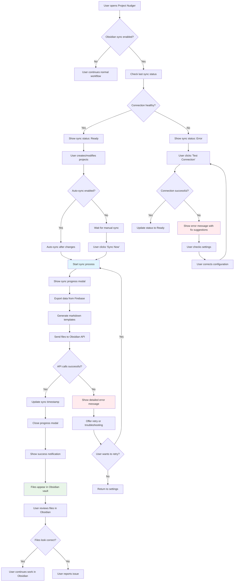

# Project Nudger ↔ Obsidian Integration: Detailed Implementation Plan

## Project Overview
Implement one-way synchronization from Project Nudger to Obsidian using the Local REST API plugin, creating structured markdown files for projects, tasks, and dashboards.

## Directory Structure Changes

```
project-nudger/
├── src/
│   ├── components/
│   │   ├── views/
│   │   │   ├── SettingsView.jsx                    # ✏️ MODIFY - Add Obsidian sync section
│   │   │   └── ObsidianSyncView.jsx                # ➕ NEW - Dedicated sync management page
│   │   └── shared/
│   │       ├── ObsidianSyncStatus.jsx              # ➕ NEW - Sync status indicator
│   │       └── ObsidianSyncModal.jsx               # ➕ NEW - Sync progress modal
│   ├── utils/
│   │   ├── obsidianSync.js                         # ➕ NEW - Core sync logic
│   │   ├── obsidianApi.js                          # ➕ NEW - REST API client
│   │   ├── markdownTemplates.js                    # ➕ NEW - Markdown generation
│   │   └── obsidianConfig.js                       # ➕ NEW - Configuration helpers
│   ├── hooks/
│   │   └── useObsidianSync.js                      # ➕ NEW - Custom sync hook
│   └── config/
│       └── obsidian.js                             # ➕ NEW - Obsidian configuration
├── docs/
│   ├── obsidian-setup.md                           # ➕ NEW - Setup instructions
│   └── sync-troubleshooting.md                     # ➕ NEW - Common issues & fixes
└── README.md                                       # ✏️ MODIFY - Add Obsidian section
```

## Implementation Tasks

### Phase 1: Core Infrastructure Setup

#### Task 1.1: Configuration and Settings
- [ ] **Create Obsidian configuration file**
  - [ ] Define default API endpoints and settings
  - [ ] Create configuration schema for validation
  - [ ] Add environment variable support for API key
- [ ] **Extend Settings View with Obsidian section**
  - [ ] Add Obsidian API endpoint input field
  - [ ] Add API key input field (password type)
  - [ ] Add vault path configuration
  - [ ] Add sync frequency options (manual/auto)
  - [ ] Add enable/disable toggle for sync feature
- [ ] **Create Obsidian settings persistence**
  - [ ] Store settings in Firebase with other user settings
  - [ ] Add settings validation before save
  - [ ] Create settings migration for existing users

#### Task 1.2: REST API Client
- [ ] **Create base API client**
  - [ ] Implement HTTP client with error handling
  - [ ] Add request/response logging for debugging
  - [ ] Create connection testing functionality
  - [ ] Add timeout and retry logic
- [ ] **Implement core API methods**
  - [ ] `createNote(path, content)` - Create new markdown file
  - [ ] `updateNote(path, content)` - Update existing file
  - [ ] `deleteNote(path)` - Remove file
  - [ ] `listNotes(path)` - List files in directory
  - [ ] `getNote(path)` - Read file content
- [ ] **Add API response handling**
  - [ ] Parse API responses and errors
  - [ ] Create standardized error messages
  - [ ] Add network connectivity checks

### Phase 2: Data Processing and Templates

#### Task 2.1: Markdown Template System
- [ ] **Create project template generator**
  - [ ] Design project frontmatter schema
  - [ ] Generate project overview with metadata
  - [ ] Include task list with completion status
  - [ ] Add project statistics (completion %, age, etc.)
  - [ ] Include project URL and category information
- [ ] **Create task template generator**
  - [ ] Design task frontmatter schema
  - [ ] Generate individual task files
  - [ ] Include task details, tags, and due dates
  - [ ] Add links back to parent project
  - [ ] Include session notes and time tracking data
- [ ] **Create dashboard template generator**
  - [ ] Generate master task dashboard
  - [ ] Create project overview dashboard
  - [ ] Add recommended next task section
  - [ ] Include nudge status and statistics
  - [ ] Add last sync timestamp

#### Task 2.2: Data Transformation Logic
- [ ] **Create data export utilities**
  - [ ] Export all projects with related tasks
  - [ ] Calculate project completion percentages
  - [ ] Generate nudge scores for prioritization
  - [ ] Include time tracking summaries
- [ ] **Implement incremental sync detection**
  - [ ] Track last sync timestamp per item
  - [ ] Identify changed projects and tasks
  - [ ] Create sync manifest for tracking
  - [ ] Optimize sync to only update changed items
- [ ] **Add data validation**
  - [ ] Validate data before sending to Obsidian
  - [ ] Sanitize markdown special characters
  - [ ] Ensure valid file names and paths
  - [ ] Check for required fields

### Phase 3: User Interface Components

#### Task 3.1: Settings Interface
- [ ] **Design Obsidian settings section**
  - [ ] Create collapsible settings panel
  - [ ] Add connection status indicator
  - [ ] Include test connection button
  - [ ] Add sync history display
- [ ] **Implement settings validation**
  - [ ] Real-time validation for API endpoint
  - [ ] API key format validation
  - [ ] Path validation for vault directory
  - [ ] Show validation errors inline
- [ ] **Add settings help and documentation**
  - [ ] Tooltip explanations for each setting
  - [ ] Link to setup documentation
  - [ ] Include troubleshooting tips

#### Task 3.2: Sync Status and Progress
- [ ] **Create sync status indicator**
  - [ ] Show last sync time in header/dashboard
  - [ ] Display sync status (idle, syncing, error)
  - [ ] Add sync progress indicator
  - [ ] Include sync statistics (items updated)
- [ ] **Implement sync progress modal**
  - [ ] Show real-time sync progress
  - [ ] Display current operation (creating/updating files)
  - [ ] Include cancel sync functionality
  - [ ] Show detailed error messages if sync fails
- [ ] **Add sync history log**
  - [ ] Display recent sync operations
  - [ ] Show success/failure status for each sync
  - [ ] Include detailed error information
  - [ ] Add clear history functionality

#### Task 3.3: Manual Sync Controls
- [ ] **Add sync button to main interface**
  - [ ] Place sync button in settings view
  - [ ] Add sync button to dashboard (optional)
  - [ ] Include sync all vs. incremental options
  - [ ] Add keyboard shortcut for sync (Ctrl/Cmd+Shift+S)
- [ ] **Implement sync confirmation dialog**
  - [ ] Show preview of changes before sync
  - [ ] List files that will be created/updated
  - [ ] Include estimated sync time
  - [ ] Add option to continue with sync

### Phase 4: Core Sync Implementation

#### Task 4.1: Sync Engine
- [ ] **Create main sync orchestrator**
  - [ ] Coordinate data export and API calls
  - [ ] Handle sync state management
  - [ ] Implement error recovery and rollback
  - [ ] Add sync operation queuing
- [ ] **Implement sync strategies**
  - [ ] Full sync (all data) functionality
  - [ ] Incremental sync (changes only)
  - [ ] Force sync (ignore timestamps)
  - [ ] Selective sync (specific projects/tasks)
- [ ] **Add sync conflict handling**
  - [ ] Detect when Obsidian files were manually modified
  - [ ] Provide conflict resolution options
  - [ ] Backup existing files before overwrite
  - [ ] Add manual merge capabilities

#### Task 4.2: File Organization
- [ ] **Create Obsidian folder structure**
  - [ ] `/Nudger/Projects/` - Individual project files
  - [ ] `/Nudger/Tasks/` - Individual task files (optional)
  - [ ] `/Nudger/Dashboards/` - Summary and overview files
  - [ ] `/Nudger/Archives/` - Completed/archived items
- [ ] **Implement file naming strategy**
  - [ ] Sanitize project/task names for file names
  - [ ] Handle duplicate names with timestamps
  - [ ] Create consistent naming conventions
  - [ ] Add file organization options in settings
- [ ] **Add file cleanup logic**
  - [ ] Remove files for deleted projects/tasks
  - [ ] Archive completed items
  - [ ] Clean up orphaned files
  - [ ] Maintain file organization integrity

### Phase 5: Advanced Features and Polish

#### Task 5.1: Auto-sync Capabilities
- [ ] **Implement automatic sync triggers**
  - [ ] Sync after task completion
  - [ ] Sync after project creation/modification
  - [ ] Time-based sync (every X minutes)
  - [ ] Sync on application startup
- [ ] **Add smart sync scheduling**
  - [ ] Debounce rapid changes to avoid spam
  - [ ] Queue sync operations during high activity
  - [ ] Respect sync frequency settings
  - [ ] Add sync pause/resume functionality
- [ ] **Create background sync worker**
  - [ ] Run sync operations without blocking UI
  - [ ] Show background sync progress
  - [ ] Handle network interruptions gracefully
  - [ ] Add background sync error notifications

#### Task 5.2: Error Handling and Debugging
- [ ] **Implement comprehensive error handling**
  - [ ] Network connectivity errors
  - [ ] API authentication failures
  - [ ] File permission errors
  - [ ] Invalid data format errors
- [ ] **Add debugging and logging**
  - [ ] Create debug mode toggle in settings
  - [ ] Log all API requests and responses
  - [ ] Export sync logs for troubleshooting
  - [ ] Add verbose error messages
- [ ] **Create user-friendly error messages**
  - [ ] Translate technical errors to user language
  - [ ] Provide suggested solutions for common issues
  - [ ] Add links to troubleshooting documentation
  - [ ] Include contact information for support

#### Task 5.3: Documentation and Testing
- [ ] **Create user documentation**
  - [ ] Write Obsidian plugin setup guide
  - [ ] Document sync configuration process
  - [ ] Create troubleshooting guide
  - [ ] Add FAQ section
- [ ] **Write developer documentation**
  - [ ] Document API integration patterns
  - [ ] Create code examples and tutorials
  - [ ] Document configuration options
  - [ ] Add contribution guidelines
- [ ] **Implement testing strategy**
  - [ ] Unit tests for sync utilities
  - [ ] Integration tests for API client
  - [ ] End-to-end sync testing
  - [ ] Manual testing checklist

## UI Flow and Mockups

### Settings View Enhancement

```
┌─────────────────────────────────────────────────────────────┐
│ Settings                                                    │
├─────────────────────────────────────────────────────────────┤
│                                                             │
│ [General] [Integrations] [Obsidian Sync] [Data Management] │
│                                                             │
│ ┌─ Obsidian Integration ─────────────────────────────────┐ │
│ │                                                        │ │
│ │ ☑ Enable Obsidian Sync                                │ │
│ │                                                        │ │
│ │ API Endpoint: [http://localhost:27123           ] [🔗] │ │
│ │ API Key:      [••••••••••••••••••••••••••••••••] [👁] │ │
│ │ Vault Path:   [/Nudger                          ]     │ │
│ │                                                        │ │
│ │ Sync Mode:    [● Manual  ○ Auto (every 5 min)]        │ │
│ │                                                        │ │
│ │ Last Sync:    2 minutes ago ✅                         │ │
│ │ Status:       Connected and ready                      │ │
│ │                                                        │ │
│ │ [Test Connection] [Sync Now] [View Sync History]      │ │
│ │                                                        │ │
│ └────────────────────────────────────────────────────────┘ │
│                                                             │
└─────────────────────────────────────────────────────────────┘
```

### Sync Progress Modal

```
┌─────────────────────────────────────────────────────────────┐
│ Syncing to Obsidian...                                 [×] │
├─────────────────────────────────────────────────────────────┤
│                                                             │
│ ████████████████████░░░░░░░░ 67% Complete                   │
│                                                             │
│ Currently: Updating "Website Redesign" project             │
│                                                             │
│ Progress:                                                   │
│ ✅ Created 3 project files                                  │
│ ✅ Updated 12 task files                                    │
│ 🔄 Generating dashboards...                                │
│ ⏳ Cleaning up orphaned files                               │
│                                                             │
│ ┌─ Recent Activity ─────────────────────────────────────┐  │
│ │ ✅ Created: Projects/Website Redesign.md              │  │
│ │ ✅ Updated: Projects/Mobile App Development.md        │  │
│ │ ✅ Created: Tasks/Design Homepage Mockup.md           │  │
│ │ 🔄 Creating: Dashboards/Task Overview.md              │  │
│ └─────────────────────────────────────────────────────────┘  │
│                                                             │
│                           [Cancel Sync]                     │
│                                                             │
└─────────────────────────────────────────────────────────────┘
```

### Dashboard Sync Status Widget

```
┌─ Obsidian Sync Status ──────────────────┐
│                                         │
│ 🟢 Connected                            │
│ Last sync: 3 minutes ago                │
│ Files synced: 15 projects, 47 tasks     │
│                                         │
│ [Quick Sync] [Settings]                 │
│                                         │
└─────────────────────────────────────────┘
```

## User Story Flow Diagram



## Implementation Timeline

### Week 1: Foundation (8-12 hours)
- [ ] Set up configuration system
- [ ] Create basic API client
- [ ] Design markdown templates
- [ ] Add settings UI components

### Week 2: Core Sync (10-15 hours)
- [ ] Implement sync engine
- [ ] Create file organization logic
- [ ] Add progress tracking
- [ ] Basic error handling

### Week 3: UI Polish (6-10 hours)
- [ ] Enhance sync status indicators
- [ ] Add sync history
- [ ] Improve error messages
- [ ] User testing and feedback

### Week 4: Advanced Features (8-12 hours)
- [ ] Auto-sync capabilities
- [ ] Advanced debugging tools
- [ ] Documentation
- [ ] Final testing and refinement

## Success Metrics

### Technical Success
- [ ] Successfully creates/updates files in Obsidian
- [ ] Handles network errors gracefully
- [ ] Sync completes in under 30 seconds for typical data
- [ ] Zero data loss during sync operations

### User Experience Success
- [ ] Setup takes less than 5 minutes
- [ ] Sync status is always clear to user
- [ ] Error messages lead to successful resolution
- [ ] Files in Obsidian are well-formatted and useful

### Integration Success
- [ ] Works with existing LiveSync setup
- [ ] Phone sync works when on home WiFi
- [ ] No conflicts with other Obsidian plugins
- [ ] Maintains Project Nudger performance